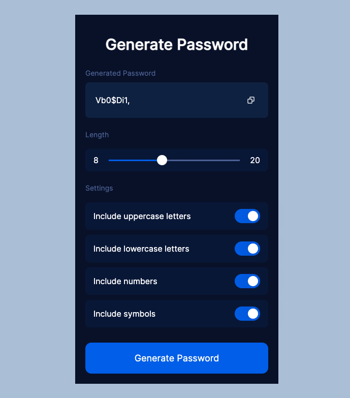

# Password Generator

This simple password generator project allows you to create strong and secure passwords with ease. Customize the length and choose from various character sets to generate passwords that meet your specific requirements.

## Usage

1. Open the HTML file in your web browser.
2. Adjust the password length and character sets as needed.
3. Click the "Generate Password" button to create a new password.

Feel free to use and modify this password generator for your personal or project needs. Happy password generating!

